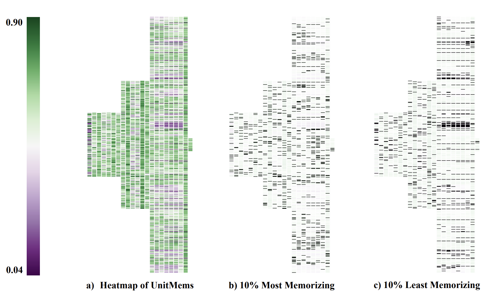

# VAR Encoder Memorization Analysis

This project investigates memorization in the encoder of a Visual Autoregressive (VAR) model, specifically the VAR-d16 model, a smaller variant based on the VQVAE architecture.  The analysis uses a modified version of the UnitMem method to quantify memorization at the unit (channel) level within the convolutional layers of the encoder.  This README provides a brief overview; see the included PDF report for full details, methodology, and results.

## Overview

The core goal is to understand *where* and *what* the VAR encoder memorizes from its training data (a subset of ImageNet).  We achieve this by:

1.  **Activation Collection:**  We extract the activation outputs of each layer in the encoder for a set of images.  These activations are averaged across multiple augmentations of each image to improve robustness.
2.  **UnitMem Calculation:**  A modified UnitMem score is computed for each channel (unit) within each layer.  The modification accounts for the presence of negative activations, which are not considered in the original UnitMem paper. We use absolute values of activations.
3.  **Analysis:** We examine the distribution of UnitMem scores, identify the most and least memorizing units, and analyze the characteristics of the images that most strongly activate these units.

## Key Findings (see report for details)

*   **Distributed Memorization:**  High-memorizing units are found across various layers of the encoder, not just the deepest ones.  This suggests that memorization is not solely a function of network depth.
*  **`down.3.block.1` Significance:** A noticeable concentration of high-memorizing units is observed in the `down.3.block.1` layer.
*   **Image Characteristics:** Preliminary analysis suggests a correlation between image features and memorization:
    *   **High Memorization:**  Images with high-frequency patterns (e.g., grids) and images of insects tend to be highly memorized.
    *   **Low Memorization:** Images with less distinct foreground/background separation and those containing large, uniform areas (like plants) tend to be less memorized.
*   **Modified UnitMem:** Because of the presence of negative activation values in the VQVAE, we take the absolute value for UnitMem.

## Important Considerations

*   **Data Subset:** Due to resource constraints, the analysis is performed on a *subset* of ImageNet (10,000 images).  Results may differ when using the full dataset.
*   **Preliminary Findings:**  The image characteristic analysis is preliminary.  Further, more rigorous investigation is needed to confirm and quantify these observations.
*   **No ICLR Submission:** This is just a template. The code is a study of memorization, not a conference submission.